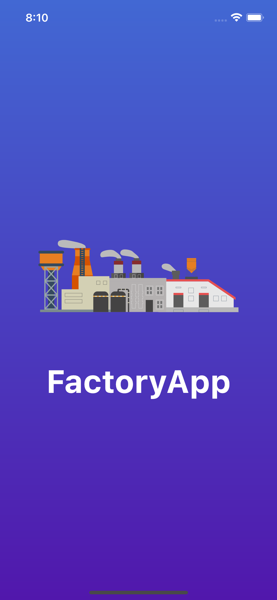
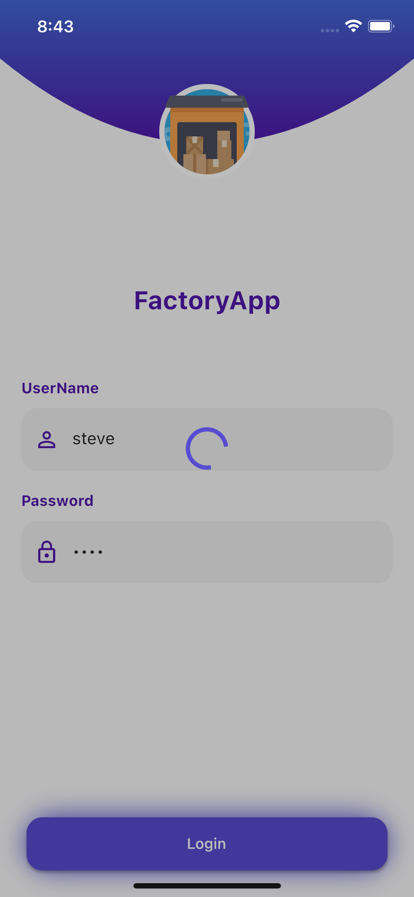
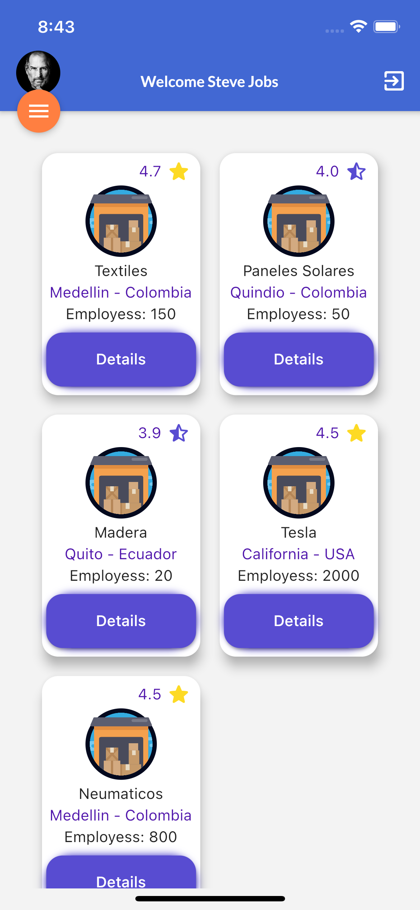
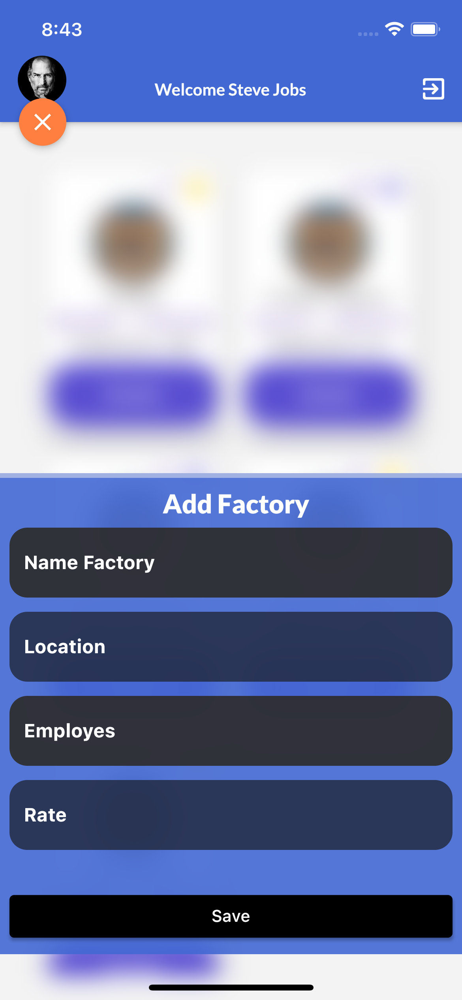

# Factoryapp.
 A new Flutter project with [provider](https://pub.dev/packages/provider)

# Preview
 
 

## Prerequisites
A Flutter installation and configuration must be done.
- [Flutter](https://flutter.io/) 2.0.0

- cd into the repo folder.

 run flutter -> run-android or flutter run-ios to build the app.

- to authenticate users: steve password: jobs - user: elon password: musk

(Please note that a Mac with XCode is required to build for iOS)

## Getting Started

This project is a starting point for a Flutter application.

A few resources to get you started if this is your first Flutter project:

## Configuring Android Studio to run this new configuration

You can go to the dropdown that says `main.dart` and select `Edit configurations`. Hit the + button and add a new Flutter configuration and name it as you please.
- For the entry point, select Dart's main class.

Once done, you can select any flavor you configured and run it using the play or debug button.

## Git rules
We're using Git Workflow. Every project collaborator **MUST** follow the Git Workflow, explained [here](https://www.atlassian.com/git/tutorials/comparing-workflows/gitflow-workflow).

## Code rules
Let's follow Flutter general [conventions](https://flutter.dev/docs/perf/rendering/best-practices) & general good practices as well.
